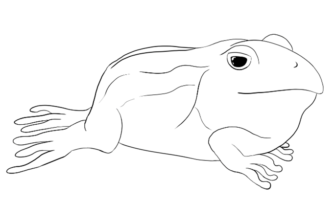

**Nombre del Juego: Ribbit Rumble**

**Temática: Juego de Lucha 2D de ranas estilo Cartoon**

**Miembros del equipo de Desarrollo:**

Carlos Santayana Vicente                  

* *Correo institucional: c.santayana.2021@alumnos.urjc.es*

* *Usuario de GitHub: carlossantayana*

Alejandro Pérez Carretero         

* *Correo institucional: a.perezc.2021@alumnos.urjc.es*

* *Usuario de GitHub: AlexPC03*

Sebastián Loges de Faria

* *Correo institucional: s.loges.2021@alumnos.urjc.es*

* *Usuario de GitHub: Sebastian02L*

Marcos De Ozaeta Cabadas

* *Correo institucional: m.deozaeta.2021@alumnos.ujrc.es*

* *Usuario de GitHub: Mdoc14*

**Documento de Diseño del Juego “Ribbit Rumble”**

# Índice
[1.	Introducción	](#_toc148190696)

[2.	Personajes	](#_toc148190697)

[3.	Mecánicas	](#_toc148190698)

[4.	Estados del Juego	](#_toc148190699)

[5.	Interfaces	](#_toc148190700)

[6.	Niveles	](#_toc148190701)

[7.	Música y Sonidos	](#_toc148190702)

[8.	Referencias	](#_toc148190703)

 # Introducción
**Ribbit Rumble** es un juego en red multijugador perteneciente al género de lucha, donde dos jugadores lucharán entre ellos en cada partida. Los personajes del juego están tematizados con ranas cuyas habilidades en combate dependerán de su especie.

El videojuego tiene una calificación PEGI 12, ya que es apto para todos los públicos, pero puede contener escenas que podrían afectar a algunos jugadores. Se busca atraer la atención de un público casual, que disfrute de los juegos de lucha donde puedan emplear diversas estrategias para vencer a su contrincante.

El estilo artístico del videojuego es “cartoon 2D”. Este estilo ayudará a transmitir a los jugadores un ambiente divertido y gracioso dentro del juego.

**Ribbit Rumble** será el primer juego de la saga, con el que buscamos conseguir la mayor cantidad de jugadores posible, que estén interesados en los enfrentamientos uno contra uno. El videojuego estará disponible para PC a través de diversas tiendas digitales. De esta manera, al ser una de las plataformas con más usuarios actualmente, el juego estará al alcance de un alto porcentaje de jugadores. El videojuego tendrá un modelo de negocio gratuito con donaciones opcionales, similar al conocido “Buy me a Coffe”.

La jugabilidad en red se conseguirá con una arquitectura cliente/servidor, con una comunicación sustentada por una API REST y WebSockets. Un ordenador actuará como servidor mientras que otros dos actuarán como clientes. 
 # Personajes
Los jugadores podrán escoger entre 4 personajes distintos, basados en ranas de diferentes especies, como se mencionó anteriormente:

- **La Rana de Lluvia**, científicamente conocida como “***Breviceps gibbosus”,*** es una rana africana cuyas principales características son la forma esférica de su cuerpo y sus ojos oscuros, que le dan un aspecto de caricatura. En el juego tiene el nombre de Furu.

 ***“Rana de Lluvia”***     

***“Concept Rana de Lluvia”***

- **Rana Punta de Flecha**, con “***Dendrobatidae*”** como su nombre científico, originaria de América del Sur, es una rana venenosa que llama la atención de sus depredadoras con sus patrones y colores brillantes, cuanto más llamativos son, más tóxico es el contacto con estas. En el juego tiene el nombre de Klein.

***“Rana Punta de Flecha”***

***“Boceto de personaje Punta de Flecha”***

- **Rana Toro**, conocida también por su nombre científico “***Lithobates catesbeianus”***, presente en muchos continentes, es una especie que puede llegar a medir 20 cm de largo y llegar a pesar casi un kilo. Se caracteriza por comerse a otras ranas. En el juego tiene el nombre de Bull.

***“Rana Toro”***

***“Boceto de personaje Rana Toro”***

- **Rana Trepadora,** cuyo nombre científico es “***Boana pulchella***”, se distribuye por la mayor parte de América de Sur, en arroyos y lagunas. Se caracteriza por su piel de color verde o amarillo uniforme, su pequeño tamaño y el volumen de su saco vocal al hincharse. En el juego tiene el nombre de Juan.

***“Rana Trepadora”***

***“Boceto de personaje Rana Trepadora”***

 # Mecánicas
La perspectiva del juego será una cámara lateral fija que mostrará todo el escenario donde se desarrollará el combate.

El juego compartirá muchas mecánicas presentes en otros videojuegos del género de lucha. Empezando por el movimiento básico de los personajes. Los jugadores podrán moverse a la izquierda y a la derecha, así como saltar y agacharse. Las teclas que permitirán esto son la “A”, “D”, “W” y la “S”.  

Cada jugador tendrá una barra de vida, una barra de habilidad especial y un contador de rondas ganadas, que se podrán consultar en la interfaz que estará sobre la pantalla en la zona superior.

Los jugadores podrán atacar al pulsar la tecla “F”, siendo este un ataque distinto dependiendo del estado en el que esté (agachado, en el aire…), asimismo, se podrán bloquear los golpes presionando la tecla “G”, que reducirá en parte el daño producido por el golpe. El medidor de la habilidad especial se va llenando conforme se aciertan golpes y se bloquean ataques, cuando este está lleno, el jugador podrá realizar un ataque especial al pulsar a la vez las teclas “F” y “G”. Este ataque también podrá ser bloqueado.

En la siguiente tabla se muestran los controles para ambos jugadores en función del modo de juego seleccionado:

A continuación, se detallan los ataques de cada personaje, así como sus estadísticas:

La mayoría de los ataques variarán en la velocidad y la animación para cada personaje. Todos los ataques tienen el mismo alcance a excepción del ataque especial:

**Rana de Lluvia:** Sus ataques tienen una velocidad normal, un daño moderado, y se basan en el movimiento del cuerpo completo del personaje (aprovechando así su forma esférica):

-Ataque básico: Embiste hacia delante con su cuerpo.

-Ataque bajo: Rueda hacía la rana rival, causando daño y empujándolo.

-Ataque ascendente: Salta y hace un “backflip”, con las patas delanteras estiradas.

-Ataque aéreo: Da una vuelta sobre sí misma con ambas patas estiradas.

-Bloqueo: Se da la vuelta para enseñar la parte trasera de su cuerpo.

-Ataque especial: Bosteza mientras hace un sonido que adormece al enemigo por unos segundos. Aunque se le golpee, este no despierta hasta que se acabe el efecto de la habilidad.

**Rana Punta de Flecha:** Sus ataques tienen una alta velocidad, daño por debajo de la media y utiliza sus patas delanteras y su lengua para atacar:

-Ataque básico: Realiza una “bofetada” con una de sus patas delanteras.

-Ataque bajo: Mientras está agachada, saca la lengua para atacar a lo que tiene enfrente.

-Ataque ascendente: Salta mientras mueve las patas delanteras hacia arriba.

-Ataque aéreo: Se inclina ligeramente mientras mueve las patas delanteras hacia abajo.

-Bloqueo: Se agacha y se cubre los ojos con las patas delanteras.

-Ataque especial: Salta hacia la posición del enemigo y lo envenena, bajándole la vida de manera periódica por unos segundos. 

**Rana Toro:** Sus ataques son lentos, pero bastante fuertes y utiliza su cabeza y su gran cuerpo para atacar:

-Ataque básico: Da un cabezazo hacia delante.

-Ataque bajo: Apoyada sobre su propio cuerpo, hace un aplauso con las patas delanteras.

-Ataque ascendente: Salta con la cabeza por delante para dar un cabezazo hacia arriba.

-Ataque aéreo: Extiende sus patas haciendo daño a todo lo que esté alrededor de esta.

-Bloqueo: Llena su saco vocal protegiéndola por delante.

-Ataque especial: Saca la lengua e introduce al rival en su boca, manteniéndolo encerrado dos segundos hasta que lo escupe. En ese proceso el rival pierda la mitad de su vida actual.

**Rana Trepadora:** Sus ataques tienen una velocidad estándar con daño moderado y utiliza principalmente su lengua para atacar:

-Ataque básico: Saca la lengua para atacar justo enfrente suya.

-Ataque bajo: Mientras está agachada, saca la lengua para atacar por debajo.

-Ataque ascendente: Saca la lengua con un ángulo de 45º respecto al suelo.

-Ataque aéreo: Hincha su saco vocal mientras está en el aire, haciendo un poco de daño a lo que esté cerca.

-Bloqueo: Levanta la cabeza e hincha su saco vocal.

-Ataque especial: Pega un latigazo delante de él con su lengua, causando un golpe poderoso en el rival.

 # Estados del Juego
En este apartado se muestra de forma gráfica los estados por los que se va a mover el juego. Se empieza en el “Menú Principal” desde el cual se puede acceder al “Menú de selección de Modo”, “Menú de Ajustes” y a la opción “Salir del Juego”. Siguiendo el flujo, después de elegir el modo de juego y los personajes, los jugadores escogerán el escenario donde lucharán en “Selección de Mapa”, luego pasan al estado de “Juego” donde el primer jugador en ganar dos rondas será el ganador.

Al acabar la partida se mostrará una “Pantalla de Resultados” con una serie de estadísticas. Desde este estado se puede seguir el flujo hacia el “Menú Principal” o a la “Selección de Personajes” en caso de querer empezar rápidamente una nueva partida. Desde ciertos estados se permite un flujo de ida y vuelta, como por ejemplo entre el “Menú Principal” y el “Menú de Ajustes”.

***” Diagrama de Estados del Juego”***

 # Interfaces
En cuanto a las interfaces del juego, estas se detallan a continuación:

- **Menú Principal:** Con el título del juego en la parte superior y dos ranas haciendo un pulso, el menú principal es la primera pantalla que verán los jugadores. En ella el jugador podrá pulsar tres botones:

- **Combate:** Con este botón se le dará a elegir al jugador entre juego en local o en red.
- **Ajustes:** Con este botón se abrirá el menú de ajustes.
- **Salir del juego:** Con este botón se cerrará el juego.

***“Concept de la Interfaz del menú principal”***

- **Menú de Ajustes:** En este menú se podrán cambiar diferentes parámetros.

- **Volumen general:** Controla el volumen general del juego, en el que se incluyen la música y los efectos de sonido.
- **Volumen de la música:** Controla el volumen de la música de forma independiente al resto de sonidos.
- **Volumen de efectos de sonido:** Controla el volumen de los efectos de sonido del juego (golpes, acciones, …).
- **Brillo:** Controla el brillo de la pantalla.

***“Concept de la Interfaz de menú de ajustes”***

- **Menú de Selección de Personajes:** En el centro de la pantalla se encuentran los “logos” de los cuatro personajes jugables, a los lados de la pantalla se mostrará un dibujo a cuerpo completo de la rana escogida por el jugador 1 y 2 respectivamente. Ambos jugadores podrán elegir la misma rana.

***“Concept del Menú de selección de Personajes”***

  

  

**”Dibujo de los personajes a cuerpo completo”**

- **Menú de Selección de Mapa:** En el centro de la pantalla se dispondrán tres mapas y una cuarta opción, que consiste en elegir uno de los tres mapas anteriores de forma aleatoria. Sobre el mapa que elija cada jugador saldrá J1 o J2, para aclarar cuál ha elegido cada uno. Además, a ambos lados de la pantalla saldrá en grande el mapa escogido por estos, y cuando se seleccione el mapa final en el que jugar, se decidirá a través de un parpadeo aleatorio entre ambos mapas y el elegido se iluminará.

**“Concept de la Interfaz de selección de mapas”**

- **Interfaz en Partida:** Dentro de la partida la interfaz estará situada en la zona superior de la pantalla, mostrando el icono del personaje de ambos jugadores, sus barras de vida y habilidades especiales. En el centro de esta interfaz se encuentra el temporizador de la partida y el contador de rondas ganadas, simbolizadas con unas fichas con un dibujo de la cabeza de una mosca. En el paso a la siguiente ronda, la barra de vida es reestablecida.

**“Concept de la Interfaz InGame”**

- **Pantalla de Resultados:** En la pantalla de resultados se mostrarán los personajes utilizados en pose de victoria o derrota según el jugador que haya ganado o perdido. Además, también se mostrarán el número de rondas ganadas por cada jugador en la partida y la duración total de esta.

***“Concept de la Pantalla de Resultados con Rana Toro (Izquierda) como ganador y Rana Punta de Flecha (Derecha) como perdedor”***

 # Niveles
**Jungla:**

En este escenario la pelea se desarrolla en un tronco de madera que flota en un río en la selva. La base del escenario (el propio tronco) ocupa la pantalla de un lado a otro, y en el fondo se van viendo la espesa vegetación y los árboles de la selva, que se desplazan hacia la derecha, simulando que el tronco va río abajo. Entre el tronco y la vegetación, se ve el agua del rio que va cambiando y formando ondulaciones, simulando la corriente.

***“Boceto del escenario Jungla”***

**Desierto:** 

La pelea toma lugar encima de unos ladrillos que formaban parte de una vieja pirámide. Alrededor se puede ver una barrera de cactus y entre esta y el suelo hay un montículo de arena que tapa parte de los ladrillos. Detrás de los cactus se puede ver una explanada de arena y rocas pequeñas. A lo lejos se puede apreciar una enorme pirámide en contraste con el cielo, y en el lado contrario a este hay un oasis con palmeras que se reflejan sobre el agua cristalina. A lo largo de la batalla las nubes del cielo se van desplazando desde la izquierda hasta la derecha, así como rayos del sol que van apareciendo y desapareciendo sobre el escenario.

***“Boceto del escenario del Desierto”***

**Nenúfar:**

En este escenario los jugadores pelearan encima de un nenúfar situado en un lago en mitad del bosque. En el fondo se verán dos árboles frondosos. El nenúfar donde batallarán las ranas está flotando, por lo que se apreciará un suave movimiento arriba y abajo.

***“Boceto del Nenúfar”***

 # Música y Sonidos
En el menú principal sonará una canción de rock para acompañar a la imagen de las ranas musculadas, esta misma seguirá sonando en bucle hasta que se entre en una partida.

Durante la partida, comenzará a sonar una canción concreta en función del mapa, pero con la diferencia de que estas tendrán un tono más gracioso que la del menú, acompañando a la apariencia “cartoon” de los personajes jugables que, como ya se vio en apartados anteriores, no es la misma que tienen en los menús previos a la partida. Además de la música de fondo, durante el gameplay, también se escucharán efectos sonoros tanto de la batalla como del escenario. 

En el escenario de la jungla, entre los efectos de sonido, se escuchará como el agua del mapa sigue la corriente y sonidos de ambiente de insectos y animales comunes de la selva.

En el mapa del desierto, los efectos sonoros que se escucharán en este mapa serán ventiscas y graznidos de buitres.

Por último, en el mapa del Nenúfar se escucharán “ribbits” de ranas y chapoteos en el agua.

En cuanto a los efectos de sonido de los personajes, cada ataque tendrá un sonido acompañando a la animación, el cual sonará distinto en el caso de ser bloqueado por el rival. 

Cada vez que se gane una ronda, la rana ganadora hará un “ribbit” mientras se prepara para la siguiente ronda. 

En la pantalla de resultados, sonarán aplausos mientras que de fondo se escuchan “ribbits” de la rana ganadora.  

Tanto en la pantalla de selección de personajes como de mapas, a la hora de seleccionar el personaje/mapa se escucharán diversos sonidos. En el caso de los personajes, su “ribbit” correspondiente, y para los mapas, alguno de los efectos mencionados anteriormente.

# Referencias
En este apartado están las referencias a las imágenes de terceros utilizadas que no son Creative Commons. El resto de las imágenes que no son de elaboración propia son de libre uso.

[* foto de la rana Trepadora](https://calphotos.berkeley.edu/cgi/img_query?enlarge=0000+0000+1008+1676)

